## Overview

This application guide illustrates how Docker Enterprise 2.1 can be used to deploy an IBM MQ service communicating between two applications running on separate instances of WebSphere Liberty.

The two applications can be staged using the `build` script, and the sample can then be deployed by using Docker Compose or Kubernetes.  In both cases, Docker Desktop is used to prepare and validate the initial setup before deployment on Docker Enterprise 2.1.

> Information on IBM MQ and WebSphere Liberty is provided by Docker as a known, working configuration at the time of publishing. Docker does not support IBM MQ or WebSphere Liberty. Please contact IBM Support if you have any questions or problems with them.

## IBM MQ Overview

MQ is IBM's Messaging solution for Enterprise and IBM's Message Oriented Middleware offering. It allows independent applications to securely communicate with each other across multiple systems. WebSphere Application Server provides flexible and secure runtimes for mission-critical Java enterprise applications, lightweight web applications, and microservices.

These two products are often found in enterprise IT deployments.  MQ is used to communicate securely between applications running in WebSphere Liberty servers.

## Architecture

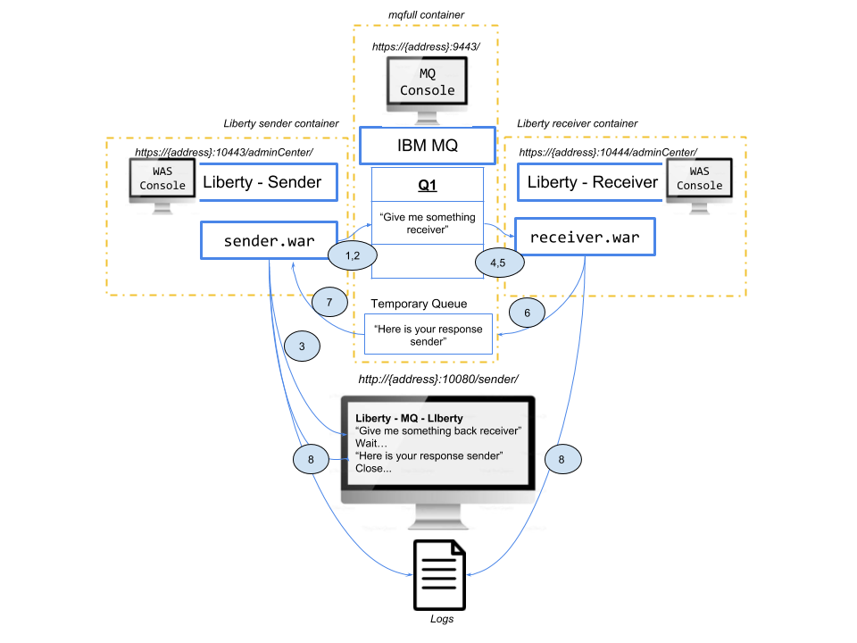

This deployment shows:

1. MQ and two Websphere Liberty servers are deployed on Docker Desktop or Docker Enterprise.  A "sender" Java application is deployed and managed by one Liberty server.  A "receiver" application is deployed and managed by the other.
2. After the containers are started, the sender application creates a connection to the queue manager (QM1).  The sender application puts a message on the queue (Q1).  This is initiated through a web browser.
3. The sender application then waits for a response from the receiver.
4. The receiver application continuously monitors the queue for messages using a message-driven bean.
5. The receiving application consumes the message from the queue and creates a response.
6. The receiving application puts the response on a temporary response queue and closes the connection to the queue.
7. The sending application then sees the message and consumes it from the queue.
8. The sending application reports its progress back to the web browser and writes the same messages out to the logs.

## Prerequisites

These are some of the resources that will be necessary for building and running the solution.  This solution brief gives steps on how to download, use, and manage these resources.  They are provided here as reference.

- [sample.docker.mq.git](https://github.com/docker/mq-liberty)
- [Docker Desktop](https://www.docker.com/products/docker-desktop)
- [Docker Enterprise 2.1 UCP 3.1.1 DTR 2.6.0 for Ubuntu](https://hub.docker.com/editions/enterprise/docker-ee-server-ubuntu)  (other platforms available)
- [Subscribe to IBM WebSphere image on Docker Hub](https://hub.docker.com/_/ibm-websphere-liberty)
- [Subscribe to IBM MQ image on Docker Hub](https://hub.docker.com/_/ibm-mq-advanced)
- [MQ Resource Adapter](https://www-945.ibm.com/support/fixcentral/)
- [Create Docker ID](https://hub.docker.com/)
- [Create IBMid](https://www.ibm.com/account/us-en/signup/register.html)

## Installation and Configuration (Docker Desktop)  

Use the following steps to install and configure IBM MQ and WebSphere Liberty:

1. Install the `git` utility if not already installed.
2. In a terminal window, navigate to the folder you would like to place the repository (or create a new one), then run the command:

    ```bash
    $ git clone https://github.com/docker/mq-liberty.git
    ```

3. MQ provides a resource adapter that allows WebSphere Liberty to connect to IBM MQ to enable it to send messages to a second web application. The MQ resource adapter is available through [IBM Fix Central](https://www-945.ibm.com/support/fixcentral/swg/selectFixes?parent=ibm~WebSphere&product=ibm/WebSphere/WebSphere+MQ&release=All&platform=Linux+64-bit,zSeries&function=all "IBM Fix Central") or from an MQ installation. To locate a version that is available for download, obtain a free [MyIBM login account](https://www.ibm.com/account/us-en/signup/register.html), unblock any popups from IBM, and search for the term "InstallRA" using the search box provided. The name of the file to be downloaded is in the format of `<V.R.M.F>-IBM-MQ-Java-InstallRA.jar` (This guide was tested with version 9.1.1.0.).
4. Click through the selection and agreement forms.   Download the most recent resource adapter. 
5. Place the downloaded resource adapter JAR into both the `liberty-sender` and `liberty-receiver` application folders found in `./sample.docker.mq`.
6. Edit the `Dockerfile` in both `liberty-sender` and `liberty-receiver` and ensure that the COPY commands for the resource adapter is up-to-date with the current resource adapter’s version (e.g. change `9.1.1.0` in two places if necessary).

7. In a browser and using a previously created [Docker ID](https://hub.docker.com), log into [Docker Hub](https://hub.docker.com).  Subscribe to both the [IBM Websphere Liberty](https://hub.docker.com/_/ibm-websphere-liberty) and [MQ Advanced](https://hub.docker.com/_/ibm-mq-advanced) images. These images are free for development.  Here are the example steps to subscribe to the `Websphere Liberty` image.  Follow the same process for the `MQ Advanced` image.

    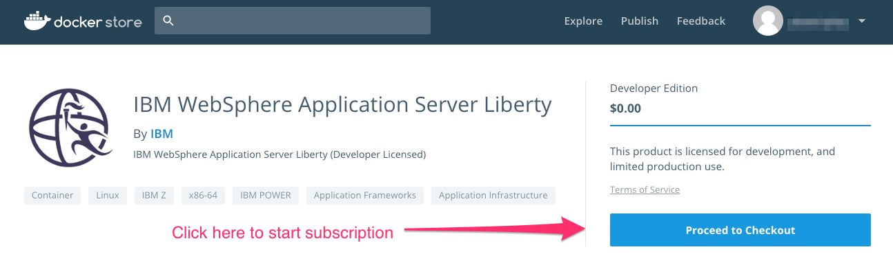

    Subscription Screen:
    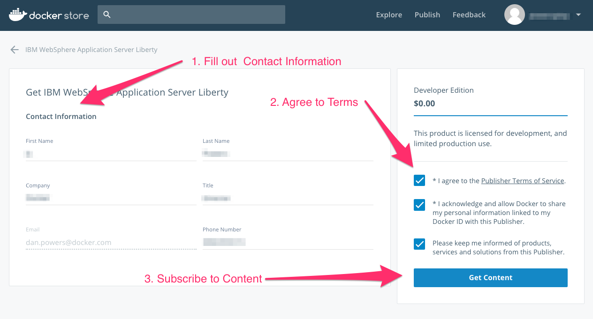

8. Back in the terminal window, execute the following command and provide Docker credentials:
    ```
    $ docker login
    ```

8. Return to the `sample.docker.mq` directory.  Execute this script to compile and build the application:

    ```bash
    $ chmod 755 build
    $ ./build
    ```

    This script uses ```maven``` to build the WAR files for both of the applications in the sender and receiver directories and makes sure they are copied the correct locations. It also builds the images for ```mq, sender```, and ```receiver``` parts of the application.

9. Verify the image creation using these Kubernetes commands:

    ```docker
    $ docker images | grep sampledockermq
    sampledockermq_receiver                                  latest              a4a12b72eebf        17 minutes ago      451MB
    sampledockermq_sender                                    latest              2d4c0406ab22        17 minutes ago      451MB
    sampledockermq_mqfull                                    latest              ad1b71dbba72        18 minutes ago      793MB
    ```

## Verifying the Deployment for Swarm on Docker Desktop 

> If using Kubernetes, proceed to _Verifying the Deployment for Kubernetes on Docker Desktop_.

To deploy on Docker Desktop using the Swarm orchestrator, execute:

```docker
$ docker-compose up
```

This brings up three containers: `mqfull`, `liberty-server`, and `liberty-receiver`.  A `docker ps` command looks something like this:

```docker
$ docker ps
CONTAINER ID        IMAGE                     COMMAND                  CREATED             STATUS              PORTS                                              NAMES
b354b1cb9ab2        sampledockermq_sender     "/opt/ibm/docker/doc…"   2 minutes ago       Up 2 minutes        0.0.0.0:10080->9080/tcp, 0.0.0.0:10443->9443/tcp   sampledockermq_sender_1
74f1270faae6        sampledockermq_mqfull     "mq.sh"                  2 minutes ago       Up 2 minutes        0.0.0.0:1414->1414/tcp, 0.0.0.0:9443->9443/tcp     sampledockermq_mqfull_1
9cf7f1e9c5bc        sampledockermq_receiver   "/opt/ibm/docker/doc…"   2 minutes ago       Up 2 minutes        0.0.0.0:10081->9080/tcp, 0.0.0.0:10444->9443/tcp   sampledockermq_receiver_1
```

> If using Swarm, proceed to _Verifying the Application on Docker Desktop_.

## Verifying the Deployment for Kubernetes on Docker Desktop 

If Kubernetes is not already enabled, access the top menu bar of your desktop, and click on **Preferences**.  Click on **Kubernetes** and choose the **Enable Kubernetes** check box.  Click on **Apply** to restart Docker Desktop with Kubernetes enabled.

 `     ` 

To deploy with the Kubernetes orchestrator, execute:

```kubernetes
$ kubectl create -f mq-kubernetes.yaml
```

This starts three services and three deployments named `mqfull`, `sender`, and `receiver`. Verify the Kubernetes deployment using the `kubectl get` command.  The output is similar to this:

```bash
$ kubectl get pods
NAME                        READY     STATUS    RESTARTS   AGE
mqfull-774b6dc98b-kb9lt     1/1       Running   0          1m
receiver-75ffbf6555-75rhj   1/1       Running   0          1m
sender-688f8879cf-825st     1/1       Running   0          1m

$ kubectl get deployments
NAME       DESIRED   CURRENT   UP-TO-DATE   AVAILABLE   AGE
mqfull     1         1         1            1           25m
receiver   1         1         1            1           25m
sender     1         1         1            1           25m

$ kubectl get services
NAME         TYPE        CLUSTER-IP      EXTERNAL-IP   PORT(S)                         AGE
kubernetes   ClusterIP   10.96.0.1       <none>        443/TCP                         5d
mqfull       NodePort    10.97.57.115    <none>        9443:30443/TCP,1414:31142/TCP   25m
receiver     NodePort    10.101.142.16   <none>        9080:31081/TCP,9443:31444/TCP   25m
sender       NodePort    10.108.30.76    <none>        9080:31080/TCP,9443:31443/TCP   25m
```

## Verifying the Application on Docker Desktop  

Access the application, the MQ Console, and the two Liberty servers:

- Application:  http://localhost:31080/sender/

    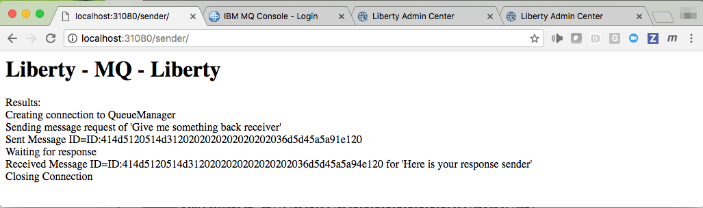

    Output to log files upon refresh of browser:

    ```bash
    sender_1    | > Results:
    sender_1    | > Creating connection to QueueManager
    sender_1    | > Sending message request of 'Give me something back receiver'
    sender_1    | > Sent Message ID=ID:414d5120514d31202020202020202020d331a85acc099921
    sender_1    | > Waiting for response
    receiver_1  | Message Received!!!
    receiver_1  | Sending reply
    receiver_1  | Closing connection
    sender_1    | > Received Message ID=ID:414d5120514d31202020202020202020d331a85acc0c9921 for 'Here is your response sender'
    sender_1    | > Closing Connection
    ```

- MQ Console: https://localhost:30443/ibmmq/console/login.html  (admin/passw0rd)

    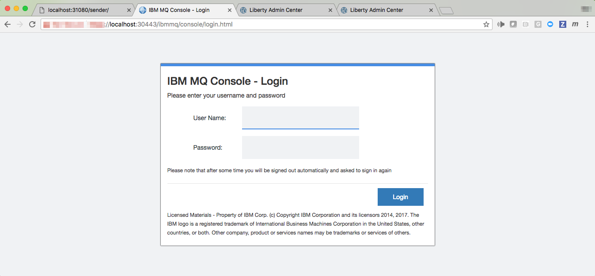

- `liberty-sender` is at https://localhost:31443/adminCenter/login.jsp (wsadmin/wsadmin); likewise, `liberty-receiver` is at https://localhost:31444/adminCenter/login.jsp.

    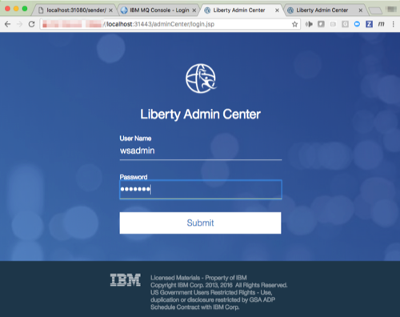

## Stopping the Application using Swarm on Docker Desktop 

> If using Kubernetes, proceed to _Stopping the Application using Kubernetes on Docker Desktop_.

To stop the application, execute:

```docker
$ docker-compose down
...
Removing sampledockermq_sender_1   ... done
Removing sampledockermq_mqfull_1   ... done
Removing sampledockermq_receiver_1 ... done
```

Proceed to _Configuration and Deployment on Docker Enterprise_.

## Stopping the Application using Kubernetes on Docker Desktop 

To stop the application, execute:

```docker
$ kubectl delete services mqfull sender receiver
service "mqfull" deleted
service "sender" deleted
service "receiver" deleted

$ kubectl delete deployments  mqfull sender receiver
deployment "mqfull" deleted
deployment "sender" deleted
deployment "receiver" deleted
```

##  Configuration and Deployment on Docker Enterprise  

To deploy IBM MQ and WebSphere Liberty on Docker Enterprise 2.1, begin with the provisioning of an appropriate number of nodes for site-specific performance and high availability:

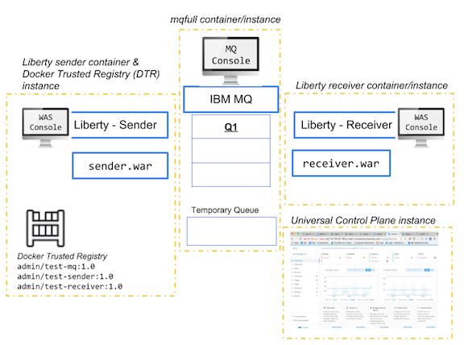

In this example, a four instance deployment was provisioned consisting of one instance for UCP Management and three instances to run each of the three worker containers: MQ, Sender, and Receiver.  UCP manages both Kubernetes and Swarm orchestration.

Docker Trusted Registry (DTR) is also installed on the instance with one of the worker containers.  This guide assumes that UCP and DTR have been installed and configured and that access to the "admin" account and password has been provided.

> Note on Kubernetes networking: This guide defines all of the container ports using `NodePort` networking.  To use `LoadBalancer` method instead, refer to the _Troubleshooting_ section towards the end of this document.

### Move Images to Docker Enterprise

Move the previously tested MQ and Liberty images to Docker Enterprise running on a cloud service provider. Since the original MQ and Liberty images have been extended during the build process, these extended images must be tagged and pushed into the cloud service provider environment. This can be done by pushing the local images to DTR and then altering the `docker-compose.yml` so that it points to these images. (If DTR is not available, the Docker Hub can be used instead)

1. Log into the DTR Mangement Console (at https://{dtr-registry-address}) as "admin".
2. Click on the **New repository** button towards the upper right portion of the window.
2. In the New Repository **name** field, enter `test-mq`, and then click on **Create**.
3. Create two more repositories named `test-sender` and `test-receiver`.  The new repositories should look like this:

    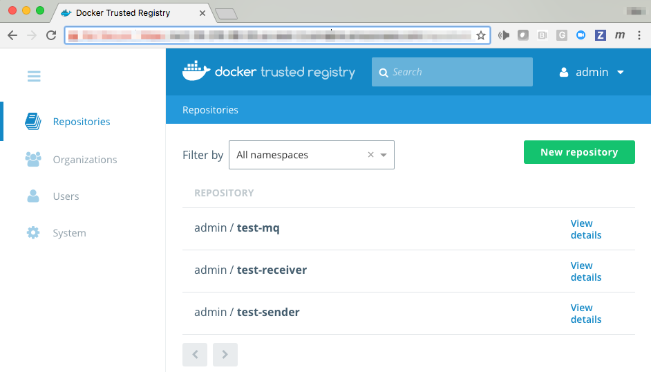

4. Logout of the DTR UI.

5. From a new terminal window on Docker Desktop, execute:

    ```bash
    $ docker logout
    ...
    $ docker login {dtr-registry-address}
    ```

6. When prompted, enter "admin" as the username and then the appropriate password.

7. Prepare the images created in the previous steps for DTR:

    ```docker
    $ docker tag sampledockermq_mqfull:1.0 {dtr-registry-address}/admin/test-mq:1.0
    $ docker tag sampledockermq_sender:1.0 {dtr-registry-address}/admin/test-sender:1.0
    $ docker tag sampledockermq_receiver:1.0 {dtr-registry-address}/admin/test-receiver:1.0
    ```

8. Push images to DTR:

    ```docker
    $ docker push {dtr-registry-address}/admin/test-mq:1.0
    ...
    $ docker push {dtr-registry-address}/admin/test-sender:1.0
    ...
    $ docker push {dtr-registry-address}/admin/test-receiver:1.0
    ...
    ```

## Deployment and Verification on Docker Enterprise using Swarm 

> If using Kubernetes, proceed to _Configuration and Deployment on Docker Enterprise using Kubernetes_.

1. In a browser, access the URL for the UCP management node and login as "admin".

2. Click on **Shared Resources** in the left sidebar, then click on **Stacks**.

    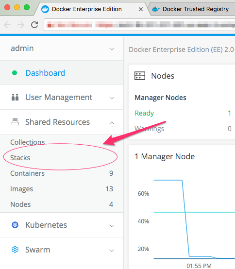

4. Click on **Create Stack** in the upper right corner:

    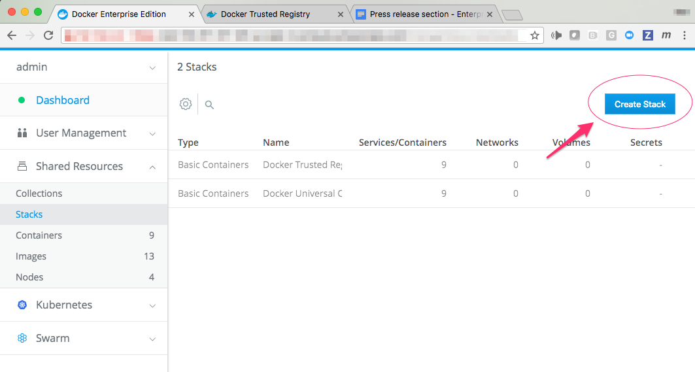

5. On the **Create Application** screen, provide an Application Name and then click **Next**. ("Orchestrator Mode" should be `SWARM SERVICES` and "Application File Mode" should be `COMPOSE FILE`)

    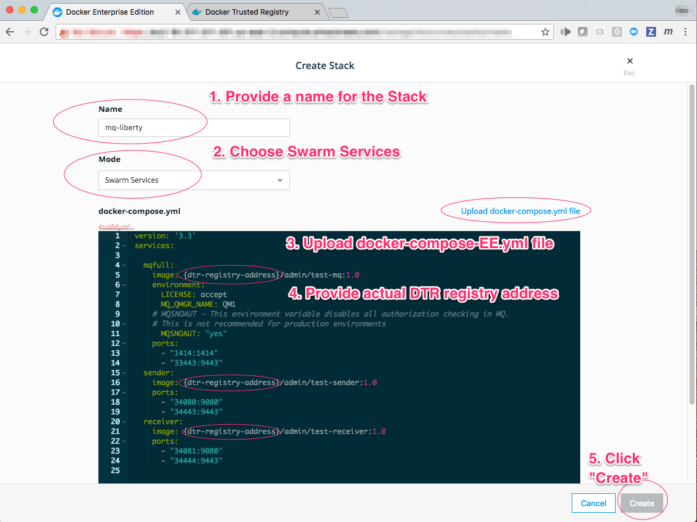

6. Click on `Upload docker-compose.yml file` and choose `docker-compose-EE.yml` from the `sample.docker.mq` directory. Change the three fields `{dtr-registry-address}` to the actual address name of the Docker Trusted Registry.  Click **Create** to launch the deployment.

    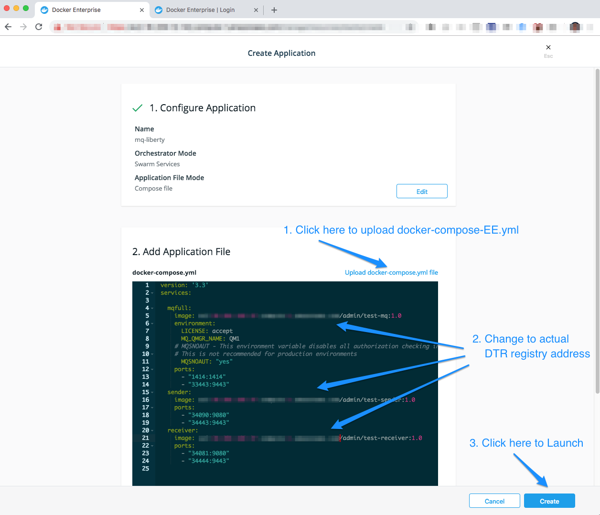

8. This **Create Application** screen announces the successful launching of the application.  Click `Done`.

    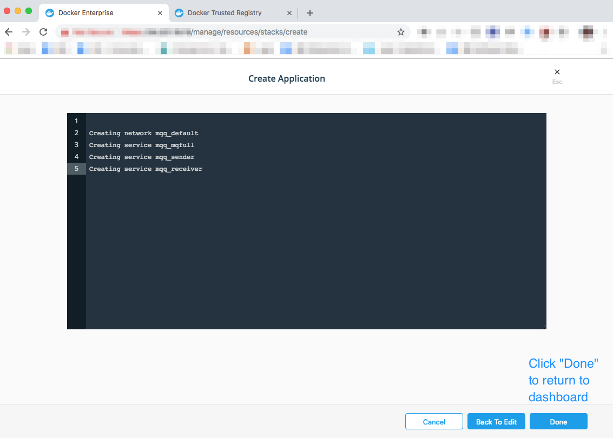

9. To verify that the containers launched successfully, click on `Services` in the left side bar on the UCP home screen. The `mqfull`, `liberty-sender`, and `liberty-receiver` show with green status and no errors.  The endpoint URLs can be accessed for each container by clicking on the name and inspecting the right hand configuration menu bar that appears.

   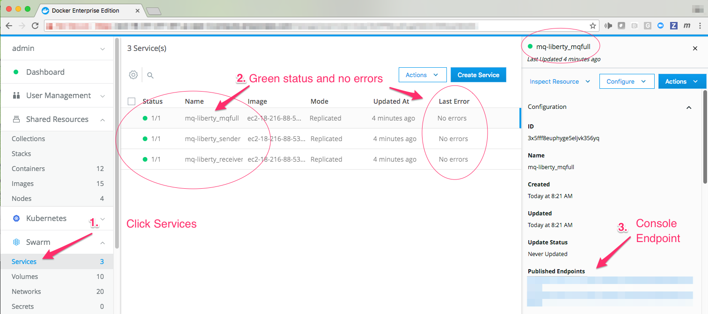

7. To verify it is functioning correctly, connect to http://{ucp-ip-address}:34090/sender/ .  After each screen refresh, the sender posts a message to receiver.  The receiver answers with a message back.  Other console applications are available as described in the previous section _Verifying the Application on Docker Desktop._

    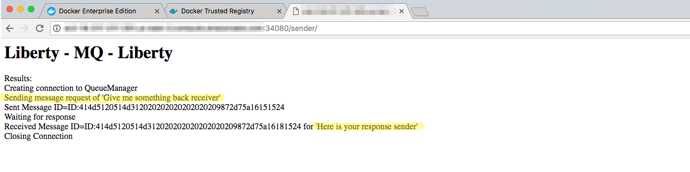

## Configuration and Deployment on Docker Enterprise using Kubernetes 

1. In a browser, access the URL for the UCP management node and login as "admin".

2. Click on **Kubernetes** drop down menu in the left sidebar, and then click on **+Create**.

    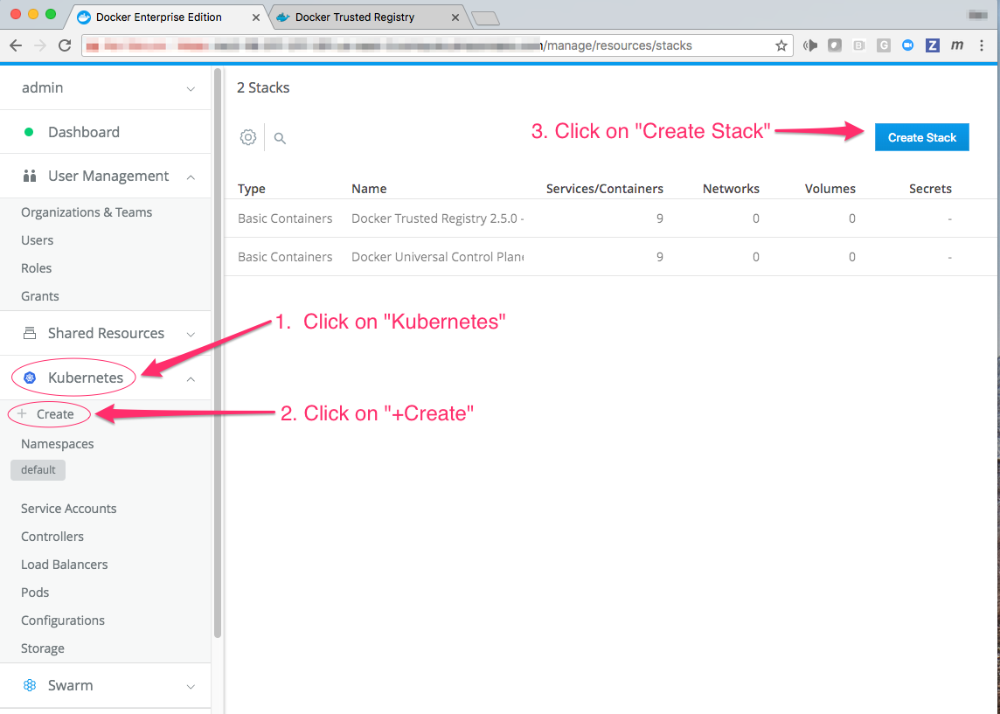

3. On the **Create Kubernetes Object** screen, choose **default** in the Namespace dropdown menu.  From the `sample.docker.mq` directory, upload the file `mq-kubernetes-EE.yaml`. Change the three fields ``{dtr-registry-address}`` to the actual address name of the Docker Trusted Registry.  Click **Create** to launch the deployment.

    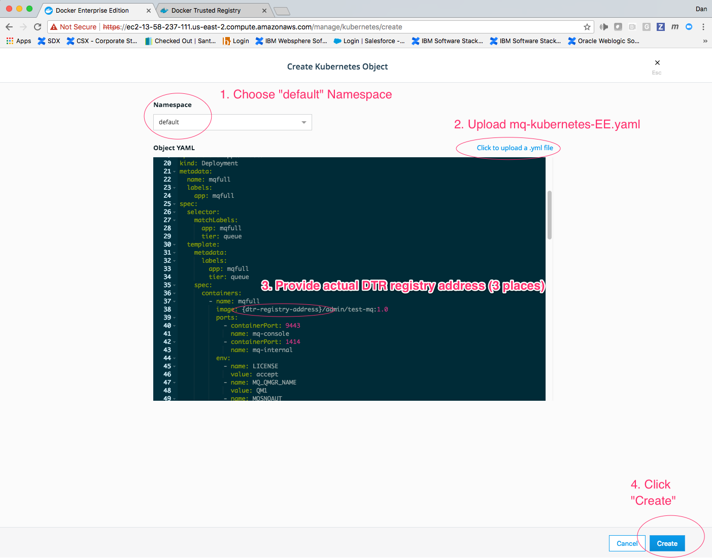

4. To verify that the containers launched successfully, click on **Pods** in the left sidebar on the UCP home screen. The `mqfull`, `liberty-sender`, and `liberty-receiver` show with green status and no errors.

    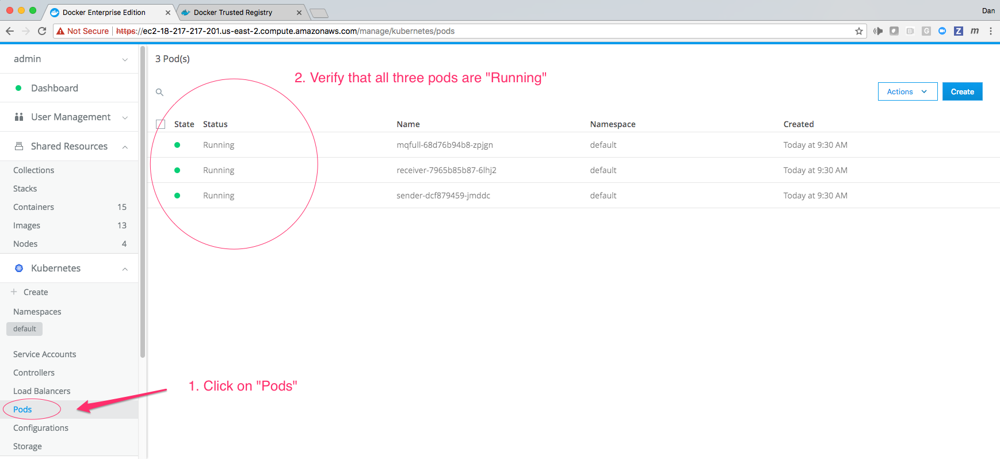

5. To bring up the application, in a browser enter: 
> https://{UCP-address}:34090/sender/

After each screen refresh of the window, the sender will post a message to receiver.  The receiver answers with a message back.


Other applications are accessible:
 - `MQ Console`: https://{ucp-ip-address}:33443/ibmmq/console/login.html  (admin/passw0rd)
 - `liberty-sender Console`: https://{ucp-ip-address}:34443/adminCenter/login.jsp (wsadmin/wsadmin)
 - `liberty-receiver Console`: https://{ucp-ip-address}:34444/adminCenter/login.jsp (wsadmin/wsadmin)

> If using Kubernetes, proceed to _Stopping Application on Enterprise using Kubernetes_.

## Stopping the Application on Enterprise using Swarm 

To stop the solution, click on **Stacks** in the left sidebar, and then click on the "Name" of the stack.  A menu bar appears on the right.  Click on **Remove** to stop and remove the containers.


## Stopping the Application on Enterprise using Kubernetes 

To stop the solution, remove the **Controllers** entries for `mqfull`, `sender`, and `receiver`.  Also remove the **Load Balancer** entries for the same.

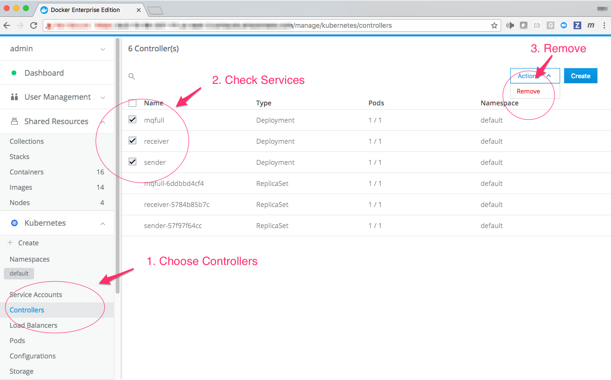

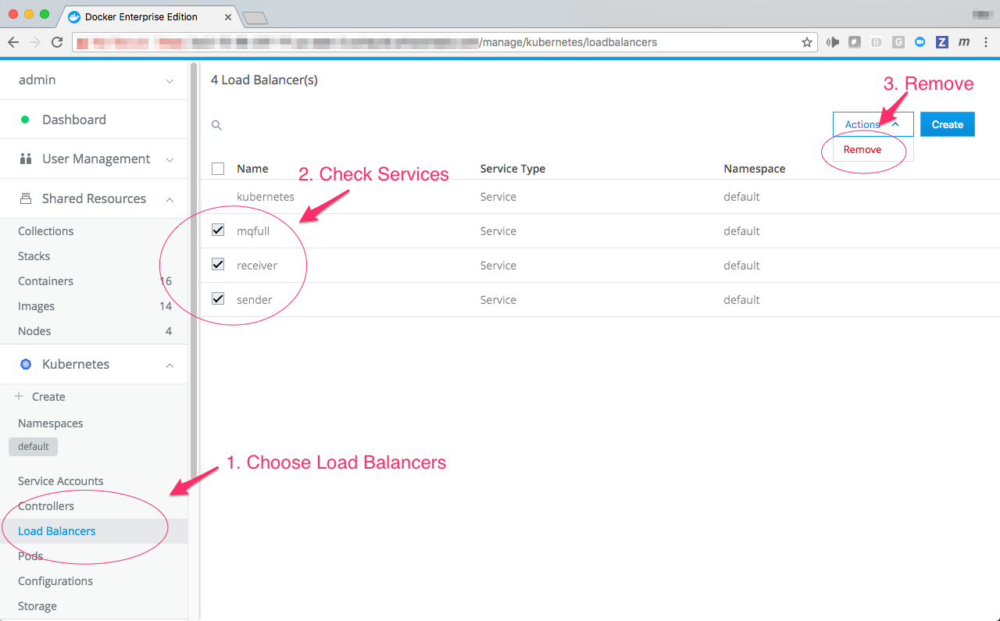

## Troubleshooting  

The following are known issues and how to workaround them.

1. If errors occur in the build or the sender/receiver communication, it may be necessary to re-build after removing all images and clearing cashes.   This can be achieved using the following commands:

    ```bash
    $ docker-compose rm
    ...
    $ docker system prune
    ...
    ```
2. Depending on your deployment circumstances, it may be necessary to list the `{dtr-registry-address}` in the Docker "insecure registries" table found under **Preferences** -> **Daemon** in the menu of the Docker toolbar icon.  If you receive certificate errors, this is a likely cause.

3. Make sure that the **Nodes** listed in the **Shared Resources** tab have the correct mix of `Kubernets`, `Swarm`, or `Mixed` resources available.

4. DTR certificates: In the case of a new Docker Enterprise installation, the `docker push` does not work, by default, with a registry endpoint that has a self-signed TLS certificate. You can use one of four options to overcome this:

    1. Upload your certificates signed by trusted CA to DTR by [following the docs](https://docs.docker.com/ee/dtr/admin/configure/use-your-own-tls-certificates/).
    This is the recommended way, and UCP will be able to download images from DTR.
    2. Modify the Docker engine config from where you will be uploading the image, and add the DTR URL among the "insecure registries" by following steps from the [Docker docs](https://docs.docker.com/registry/insecure/). Since UCP/Swarm will be downloading images from DTR, these settings will
    need to be applied to each engine on UCP. This can be done by UCP by [following the docs](https://docs.docker.com/ee/ucp/admin/configure/integrate-with-multiple-registries/).
    3. [Trust DTR's self-signed certificate on local machine](https://docs.docker.com/datacenter/ucp/2.2/guides/admin/configure/integrate-with-dtr/#1-configure-your-local-computer). Since UCP/swarm will be downloading images from DTR, DTR's CA certificate will need to be added to all the engines in UCP.
    4. If Docker Trusted Registry is not available, Docker Hub or another registry can be used to push and pull the `mqfull`, `sender`, and `receiver` images.

5. On UCP, if the Kubernetes pods show as "Pending", check to make sure that the `{DTR-address}` is entered correctly in the `mq-kubernetes.yaml` uploaded file.

6. `LoadBalancer` service type: the example in this application guide employs the `NodePort` service type.  To use `LoadBalancer` networking, the file `mq-kubernetes-EE-LB.yaml` under the `sample.docker.mq` directory defines all of the application and console ports using `type: LoadBalancer`.  Use the file in step 3 of the previous section _Configuration and Deployment on Docker Enterprise using Kubernetes_.

## Further Reading

Refer to the following links for additional information:

- [Developer Works Blog](https://developer.ibm.com/wasdev/docs/using-docker-compose-configure-topology-websphere-liberty-ibm-mq/?lnk=hm): This is the original guide for the MQ-Liberty demo published in Jan 2017.
- [Docker Hub Image MQ](https://hub.docker.com/_/ibm-mq-advanced "Docker Hub MQ Advanced")
- [Docker Hub Image WebSphere Liberty](https://hub.docker.com/_/ibm-websphere-liberty "Docker Hub Websphere Liberty")
- [David Currie Blog](http://david.currie.name/archives/2016/09/27/websphere-liberty-admin-center-in-docker "David Currie Blog")

##  Additional Application Guides and Solution Briefs

Docker provides additional application guides on [success.docker.com](https://success.docker.com/solutions#appguide) as well as [Solution Briefs](https://success.docker.com/solutions#solution-brief) about related information.
